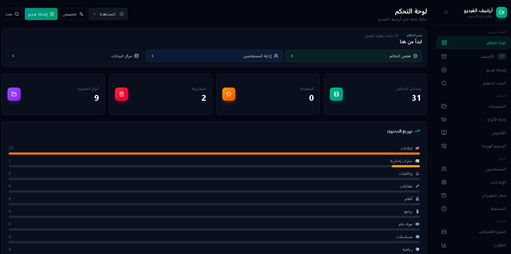
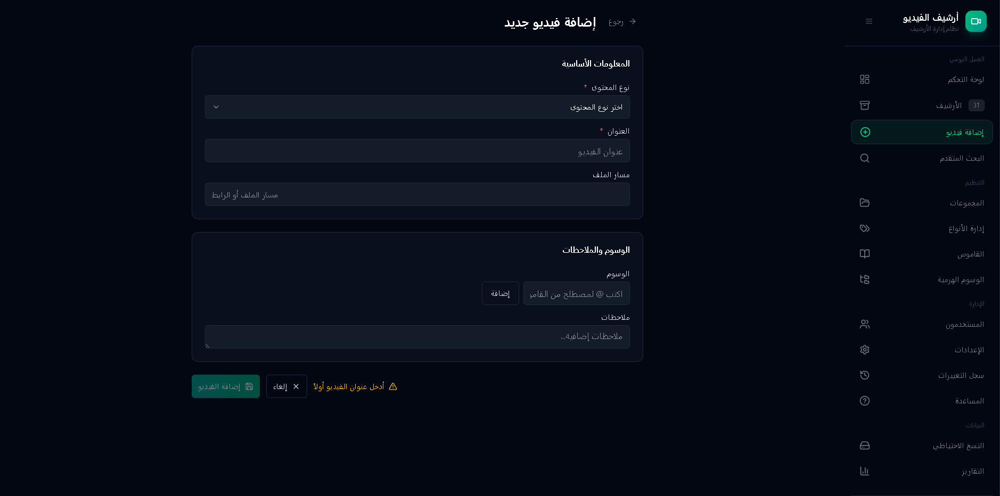

# أرشيف الفيديو — منصة أرشيف إعلامي ذكية

تطبيق أرشيف إعلامي عربي لإدارة الفيديوهات والملفات والمواد البحثية من أول
التوصيف وحتى التصدير لفريق الإنتاج. يجمع بين واجهة SPA تعمل محليًا، ونسخة
سحابية إنتاجية مبنية على منافذ قابلة للتبديل، وطبقة AI للتفريغ والتلخيص
والوسوم، وسير عمل مونتاج قابل للتصدير إلى JSON وEDL وMP4.

الهدف ليس تشغيل ملفات فيديو فقط؛ الهدف هو تحويل المادة الخام إلى أصل أرشيفي
قابل للبحث والمشاركة والمراجعة والاستخدام في غرف الإنتاج.

## ماذا يقدم؟

- **أرشيف ذكي للمواد الإعلامية:** بحث، فلاتر، saved views، مفضلة، تصنيف هرمي،
  قاموس مصطلحات، حقول مخصصة، ومؤشرات اكتمال التوصيف.
- **تشغيل محلي وسحابي:** IndexedDB للنسخة المحمولة، وPostgreSQL/PocketBase
  للنسخة السحابية عبر `@archive/core` ومنافذ التخزين.
- **تخزين ملفات متعدد:** disk وDropbox وS3-compatible وAzure Blob وGoogle Drive
  عبر FileStore server-side حتى تبقى المفاتيح خارج الواجهة.
- **ذكاء اصطناعي عملي:** تلخيص، اقتراح وسوم، تدقيق، autocomplete، chat، وترتيب
  نتائج البحث، مع تفريغ صوتي سحابي أو محلي حسب البيئة.
- **مشاريع مونتاج:** rough cuts بنقاط in/out، ترتيب timeline، وتصدير JSON/EDL/MP4
  لتقريب الأرشيف من DaVinci Resolve وAdobe Premiere.
- **مشاركة ونقل بيانات:** روابط مشاركة scoped، مركز بيانات للتصدير والاستيراد،
  وتوافق مع Excel/CSV وحزم snapshot.

## قرار معماري مهم

`CLOUD-MediaDB` يُستخدم هنا كمرجع تجربة منتج فقط: وضوح قصة الأرشيف الإعلامي،
تدفق Dropbox، التعاون، واللغة اليومية للمستخدم. لا ننقل معماريته كما هي؛ لا
`server.ts` أحادي، ولا Firestore داخل الواجهة، ولا SQLite داخل المستودع كمسار
إنتاجي بديل. المسار المعتمد هو منافذ `@archive/core`، وواجهة `@archive/app`، وخادم
`archive-server` مع محوّلات تخزين وملفات وAI قابلة للتبديل.

## الإصدارات

| الإصدار | الاستخدام | البناء |
|---------|------------|--------|
| SPA محلية | نسخة محمولة/offline-first بملف واحد | `pnpm run build:spa` |
| Cloud SPA | واجهة تتصل بخادم `archive-server` | `pnpm run build:cloud` |
| AI Studio | حزمة مهيأة لتشغيل AI Studio | `pnpm run build:aistudio` |

## المتطلبات

- Node.js 22.12+ و pnpm.
- للنسخة السحابية: `archive-server` مع Postgres أو PocketBase.
- اختياريًا: مفاتيح AI وFileStore حسب المزوّدات المطلوبة.

## التشغيل محليًا

من جذر المستودع:

```powershell
pnpm install
pnpm run dev
```

ثم افتح العنوان الذي يعرضه Vite، عادة:

```text
http://127.0.0.1:5173/
```

## البناء والتحقق

```powershell
pnpm run verify:app
pnpm run build:spa
pnpm run build:cloud
```

`build:spa` ينتج نسخة محمولة مناسبة للرفع كموقع ثابت أو للاستخدام المحلي.
`build:cloud` ينتج واجهة تتحدث مع خادم API عبر المحوّلات السحابية.

## بنية العمل

المشروع جزء من `pnpm` workspace موحد:

```text
archive-core/    # المنافذ والعقود المشتركة
archive app/     # واجهة React ونسخة SPA/Cloud، الحزمة @archive/app
archive-server/  # API، التخزين السحابي، AI، المشاركة، والتصدير
```

داخل `archive app/`:

```text
src/app/          # shell والتوجيه وسجل الصفحات
src/pages/        # صفحات الأرشيف، البحث، المشاريع، الإعدادات، البيانات
src/features/     # منطق الميزات: archive, ai, projects, sync, share...
src/storage/      # محوّلات local/cloud خلف منافذ @archive/core
src/stores/       # state slices واستمرارية البيانات
src/theme/        # الثيم والتفضيلات والحركة
docs/             # حالة المشروع، التصميم، وخطط التنفيذ
TASKS.md          # سجل المهام التنفيذية القادمة
```

## التشغيل السحابي

راجع مجلد `archive-server/` لإعداد Postgres/PocketBase وDocker/Caddy وملفات
التخزين وAI. للدليل العملي من الصفر حتى رفع مادة وتفريغها، راجع
[`docs/FULL_STACK_RUNBOOK.md`](docs/FULL_STACK_RUNBOOK.md). بعد تشغيل الخادم،
ابنِ الواجهة السحابية:

```powershell
pnpm run build:cloud
```

## لقطات شاشة





## المساهمة

قبل أي تغيير، راجع `../AGENTS.md` واختر مهمة من `TASKS.md`. كل مهمة = فرع واحد =
PR واحد، مع تشغيل `pnpm run verify:app` والبناء المناسب قبل الادعاء بالإنجاز.

## الترخيص

هذا المشروع مرخَّص بموجب ترخيص MIT.
